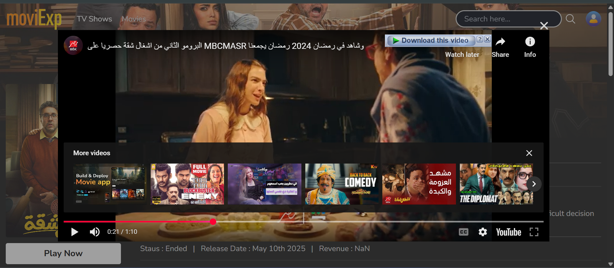
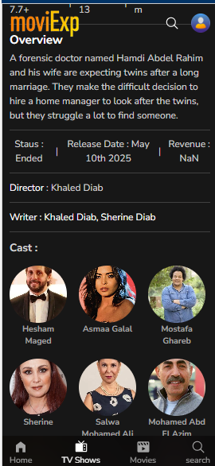

# Movie Explorer (moviExp)

## Overview

The Movie Explorer app (moviExp) is a web application that allows users to explore movies and TV shows. It integrates with The Movie Database (TMDb) API to provide real-time information, including movie details, ratings, and recommendations. This app features search functionality, a "Load More" button for pagination, and a user-friendly interface optimized for both desktop and mobile devices.

## Features

- **Search**: Allows users to search for movies and TV shows by name.
- **Trending and Recommendation**: Displays trending and recommended movies and TV shows.
- **Movie Details**: Provides detailed information about movies, including ratings, cast, and release dates.
- **Load More**: A "Load More" button that fetches additional results for better user experience.
- **Mobile-first Responsive Design**: Optimized for mobile devices, ensuring seamless navigation.

## Screenshots

### Home Page (Trending Movies)


This screenshot shows the home page of the app where users can explore trending movies and TV shows.

### Search Results Page


Here, users can see the results of their search queries, including detailed movie information.

### Movie Detail Page


This page provides detailed information about a selected movie, including ratings, cast, and a trailer link.

### Load More Functionality


The "Load More" button allows users to load additional movie results as they scroll down the page.

### Trailer Video Screen


This screenshot shows the trailer video playing screen, allowing users to watch the movie's trailer directly within the app.


## Screenshots Mobile View

| Screenshot 1 | Screenshot 2 | Screenshot 3 |
|--------------|--------------|--------------|
|  |  |  |

| Screenshot 4 | Screenshot 5 | Screenshot 6 | Screenshot 7 |
|--------------|--------------|--------------|--------------|
|  |  |  |  |

## Technologies Used

- **React**: Frontend framework for building the user interface.
- **Axios**: For making HTTP requests to the TMDb API.
- **Redux**: For managing global state.
- **TMDb API**: For fetching movie and TV show data.
- **Tailwind CSS**: For responsive, utility-first styling.
- **React Router**: For page navigation.

## Installation

1. Clone the repository to your local machine:
   ```bash
   git clone https://github.com/your-username/movie-explorer.git
2. Navigate into the project directory:
   ```bash
   cd movie-explorer
3. Install the necessary dependencies:
   ```bash
     npm install
4. Start the development server:
   ```bash
   npm start

